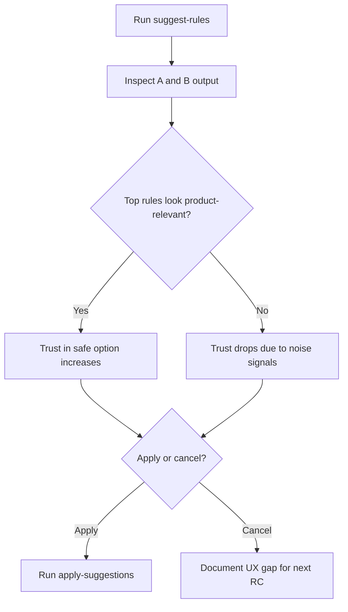

# RC-story: UX Validation For A/B Rule Suggestions

Status: Draft (next RC)
Owner: Maintainer + active agent
Scope: UX discussion and validation based on real `gittan suggest-rules` outputs

## Traceability

Use this block as mandatory metadata for RC tracking and follow-up.

- story_id: `GH-123`
- spec_status: `draft`
- implementation_status: `not built`
- created_at: `2026-04-15`
- last_updated_at: `2026-04-15`
- implementation.pr: `pending`
- implementation.branch: `pending`
- implementation.commits: `[]`
- validation.evidence: `pending`
- validation.decision: `NO-GO`
- changelog:
  - `2026-04-15: Initial draft created.`
  - `2026-04-15: Added cross-option noise overlap gate and systemic-failure rule.`
  - `2026-04-15: Added mandatory traceability metadata for build/verification status.`

Update rule:
- Any change to requirements, gates, or thresholds must update `last_updated_at`
  and append a short note in `changelog`.

## Goal

Create a decision-ready UX validation story for `gittan suggest-rules` where users can:

- understand the practical difference between Option A (`safe`) and Option B (`broad`),
- trust the recommendation quality enough to decide apply/cancel,
- and avoid applying noisy/meta rules by mistake.

## Background (test evidence)

Observed output from `gittan suggest-rules --project "Time Log Genius" --last-month`
shows a useful A/B structure but mixed confidence signals:

- Option A (`safe`) included multiple timestamp-like/meta terms such as:
  - `2026-04-08t09`
  - `2026-04-08t07`
  - `task-notification`
- Option B (`broad`) increased recall, but broad-only items included generic words:
  - `commit`
  - `credit`
  - `good`
  - `help`

Result: the feature demonstrates strong coverage potential, but users may hesitate to
apply because semantic quality is hard to judge quickly.

## UX Problem Statement

Current output explains *what* rules were found and their impact, but not clearly
enough *why this rule is trustworthy* in a human decision context.

Main UX risks:

- `safe` label may feel inconsistent when top candidates look like technical/log noise.
- broad mode can look powerful but overwhelm with low-context, generic terms.
- decision cost grows when users must manually infer confidence from raw samples.

## UX Hypotheses For This RC

1. Users decide faster and with higher confidence when each rule has explicit quality
   signaling (for example confidence or noise risk level).
2. Users trust Option A more when output separates product/domain signals from
   technical/meta signals.
3. Users are less likely to misapply rules when noisy candidates are visually grouped
   or clearly warned.

## What To Validate (non-implementation locked)

Validate UX behavior and wording, not a specific internal algorithm.

Candidate UX expectations:

- each suggested rule communicates confidence context in plain language,
- noisy/meta patterns are clearly marked as potential false positives,
- A vs B choice can be made from terminal output without reading code/spec.

## Suggested Validation Flow

## Manual UX Test Loop (RC round)

Run the same flow on 3-5 real project/timeframe combinations:

1. Run `gittan suggest-rules --project "<project>" --last-month` (or selected range).
2. Inspect top candidates in Option A and broad-only in Option B.
3. Answer quickly:
   - "Would I apply A now?"
   - "Would I apply B now?"
   - "What made me trust or distrust the result?"
4. Record if decision required deep manual parsing of samples.
5. Decide apply/cancel; if cancel, record exact blocker category.

### Suggested observation template

- Environment:
- Project/timeframe:
- A decision: apply/cancel (+ reason):
- B decision: apply/cancel (+ reason):
- Confusing terms noticed:
- Time to decision (approx):
- Overall confidence (low/medium/high):

## GO / NO-GO Criteria For UX

GO when all conditions are met:

- users can explain A vs B difference from output alone,
- top A suggestions are predominantly domain/product-relevant (not timestamp/meta-heavy),
- users can reach apply/cancel decision quickly without reading internal docs,
- noisy candidates are visible enough that accidental apply risk is low.

### Cross-option noise overlap gate

Treat shared low-quality candidates across both A and B as a hard UX risk.

- Define noise categories during review:
  - `timestamp-like`
  - `system-log/meta`
  - `generic-term`
- Evaluate the top 10 visible rules in each option.
- If more than 40% of top A rules and more than 40% of top B rules are tagged
  as noise categories, classify the run as NO-GO.
- If the same noisy rule family appears in both options, classify as systemic
  quality failure (not an A vs B tradeoff issue).

Required UX behavior when this gate fails:

- do not recommend immediate apply,
- present a "blocked: low-quality candidates" outcome in the RC notes,
- record specific fallback guidance (for example adjust timeframe, add one
  manual project anchor, rerun suggestions).

NO-GO when one or more occur:

- A (`safe`) is dominated by timestamp/internal log style rules,
- users cannot explain why a top suggestion is considered safe,
- B output feels high-volume but low-trust with unclear risk signaling,
- testers repeatedly cancel due to uncertainty rather than deliberate caution.

## RC Deliverable

A concise UX validation report for the next RC discussion including:

- evidence from 3-5 manual runs,
- confidence/trust patterns across projects,
- top recurring blocker categories,
- clear recommendation: GO, conditional GO, or NO-GO.
